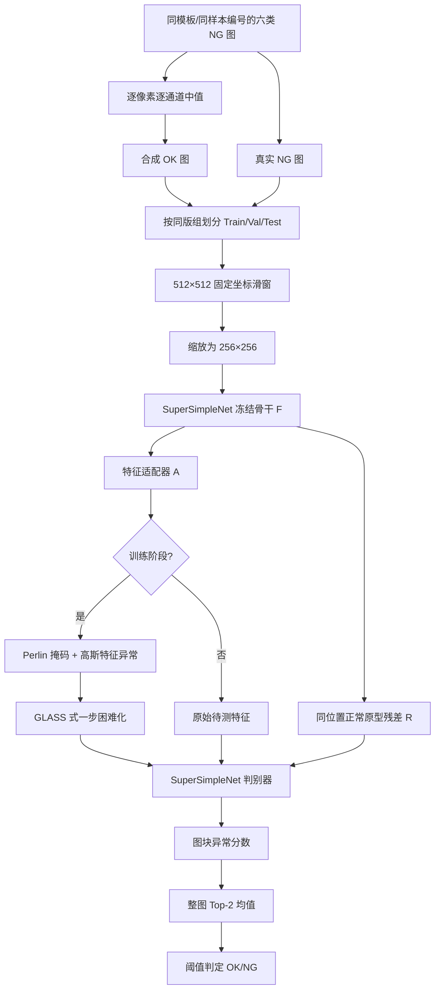

# 芯片整图 OK/NG 技术方案：CPG-SSN

> 版本：V1.0（与当前实现及 S01–S09 实验对齐）
>
> 任务：输入一张芯片/PCB 二维图像，只输出整图 `OK` 或 `NG`
>
> 主方法：SuperSimpleNet
>
> 融合模块：位置正常原型残差 + GLASS 式困难特征扰动

## 1. 项目目标与边界

### 1.1 当前目标

在每种缺陷约 30–100 张、真实正常图暂时缺失的条件下，训练一个轻量化二分类模型。模型需要识别划痕、污染、缺失、短路、断路、局部偏移等已知异常，但当前阶段不区分具体缺陷类别。

模型接口为：

```text
输入：一张完整二维芯片图像
输出：OK / NG、异常分数、模型版本、阈值版本
```

内部可以生成异常响应图，但不把定位框、分割掩码或偏移量作为业务输出。

### 1.2 已确认约束

- 每张训练图最多对应一种缺陷；所有缺陷统一合并为 `NG`。
- 原始数据只有 NG；OK 图由同型号、同位置、已对齐的多张缺陷图合成。
- 芯片结构基本固定，位置对应关系稳定，可以利用模板坐标先验。
- 当前部署在服务器 GPU，最终边缘端型号尚未确定。
- 不采用 YOLO，也不额外引入 DINO、CLIP、扩散模型或第二套大型特征网络。
- VOC 框只用于离线筛选含缺陷的训练图块，不是模型输入，也不是推理输出。

### 1.3 方案结论

采用一条完整主线：**CPG-SSN（Component/Position-Prototype Guided SuperSimpleNet）**。

它保留 SuperSimpleNet 的特征提取、特征适配、潜空间异常合成、异常图分支和整图分类分支，只在两个现成接口做小改动：

1. 借鉴 UniVAD 的“正常部件参照”思想，在共享特征上计算同模板、同坐标的正常原型残差；
2. 借鉴 GLASS 的“边界附近困难异常”思想，把 SuperSimpleNet 已生成的潜空间异常再困难化一步。

这不是三个模型串联，而是 **一个 SuperSimpleNet 主模型加两个受控模块**。GLASS 模块只用于训练；位置原型模块是推理期唯一增加的计算。

## 2. 总体流程



训练与推理的差异如下：

| 模块 | 训练 | 推理 | 是否增加在线延迟 |
|---|---|---|---|
| 冻结骨干与特征适配器 | 是 | 是 | 主流程 |
| SuperSimpleNet 潜空间异常生成 | 是 | 否 | 否 |
| GLASS 式困难特征扰动 | 是 | 否 | 否 |
| 同位置正常原型残差 | 是 | 是 | 少量余弦距离和 1×1 卷积 |
| 异常图与整图分类头 | 是 | 是 | 主流程 |
| Top-2 整图聚合 | 验证时使用 | 是 | 可忽略 |

## 3. 数据集构建

### 3.1 原始数据审计

当前数据包含 693 张真实 NG 图和 693 个 VOC XML，六种原始缺陷类型为 `missing_hole`、`mouse_bite`、`open_circuit`、`short`、`spur` 和 `spurious_copper`。

发现 115 个完整同版组。每组包含相同模板、相同样本编号的六种缺陷图；这些图的正常底图高度对齐，而缺陷位置或形态不同。两个不完整组不进入当前实验。

### 3.2 合成 OK 图

对同一完整组的六张 RGB 图，在每个坐标和每个颜色通道上取中值：

$$
I_{OK}(u,v,c)=\operatorname{median}_{i=1\ldots6} I_i(u,v,c)
$$

离散实现中，六个值排序后取中间两个值的平均。只要同一像素位置的异常没有在多数图中重复出现，中值就会保留共同的正常结构并抑制稀疏异常。

每个完整组生成一张合成 OK，因此当前共有 115 张合成 OK。该方法比逐框复制供体区域更适合现有数据，因为六张图已经对齐，不需要额外寻找供体和处理拼接边缘。

合成过程记录以下质量指标：

- 每组参与中值的图像数；
- 各成员相对中值图的平均绝对差；
- 绝对差的 P99 和最大值；
- 图像尺寸一致性和生成路径。

需要强调：合成 OK 只支持方案开发和消融实验。它与 NG 图共享底图分布，无法覆盖真实产线 OK 的照明、批次、曝光、灰尘、轻微形变和设备漂移，因此不能用当前 OK 特异度直接承诺产线误报率。

### 3.3 防止数据泄漏

划分单位不是单张图，而是完整的同版组 `pair_key`。一组中的六张 NG 和由它们合成的一张 OK 必须进入同一个集合。

当前固定划分为：

| 集合 | 同版组 | OK 整图 | NG 整图 |
|---|---:|---:|---:|
| Train | 80 | 80 | 480 |
| Validation | 15 | 15 | 90 |
| Test | 20 | 20 | 120 |

先按组划分，再生成各集合的 OK，禁止把图块随机打散后划分。

### 3.4 高分辨率图块

原图约 3000×1500，直接压缩会丢失小缺陷，因此采用模板坐标固定滑窗：

- 原图裁块：512×512；
- 默认 overlap：128；
- 轻计算量消融：overlap 64；
- 网络输入：把每个图块缩放到 256×256；
- 边缘窗口固定贴齐图像边界，保证整图覆盖。

训练时：

- 合成 OK 的所有图块作为标签 0；
- 真实 NG 只保留“VOC 框中心落入图块”的图块作为标签 1；
- 其余 NG 图中的区域暂不当作 OK，避免未标注异常污染正常集；
- 使用加权随机采样平衡 OK/NG 图块。

验证和测试时保留整张图的全部窗口。模型先给每个窗口打分，再聚合成整图分数，因此评估单位始终是整图，不是图块。

## 4. SuperSimpleNet 主流程解析

### 4.1 为什么把它作为唯一主流程

SuperSimpleNet 同时包含特征级异常合成、像素异常响应和图像级判别，能够在无监督、弱监督和监督信息强度不同的情况下复用同一结构。对本项目最重要的是：真实 NG 可以只提供图像级标签，合成异常可以提供精确的内部掩码，而最终直接产生整图异常分数。

它比目标检测方案更贴合当前需求，也不需要为每个真实缺陷制作像素掩码。工程上只保留一个卷积骨干和轻量判别头，便于后续替换为 ResNet-18、导出 ONNX/TensorRT 和批量推理滑窗。

### 4.2 阶段 A：共享特征提取

输入图块 $x\in\mathbb{R}^{3\times256\times256}$ 进入 ImageNet 预训练卷积骨干。当前实现抽取 `layer2` 和 `layer3` 的中层特征，经统一尺度和局部 patch 聚合后形成特征张量：

$$
f=F_\theta(x)
$$

骨干作为稳定的预训练表示使用；训练重点放在后续适配器和判别器。中层特征兼顾局部纹理与结构信息，比只用最后一层更适合细划痕、缺口和局部污染。

当前已验证两种骨干：

- WideResNet-50-2：用于复现和模块消融；
- ResNet-18：当前轻量化部署候选。

### 4.3 阶段 B：特征适配

预训练特征不一定直接适配芯片成像域，因此使用 SuperSimpleNet 的 feature adaptor 得到：

$$
\hat f=A_\phi(f)
$$

适配器学习把通用视觉特征映射到更容易区分本项目 OK/NG 的空间。当前配置中，异常图分支使用 $\hat f$；整图分类分支仍可保留原始 $f$，避免适配器过拟合小样本。

### 4.4 阶段 C：训练期潜空间异常合成

真实 NG 只有整图标签，不能为异常图分支提供可靠的像素掩码。SuperSimpleNet 因此在特征空间制造带精确掩码的异常：

1. 生成空间连续的 Perlin mask $m$；
2. 采样小幅高斯扰动 $\epsilon\sim\mathcal N(0,\sigma^2)$；
3. 只在 mask 内改变特征：

$$
\tilde f=\hat f+m\odot\epsilon
$$

当前 `noise_std=0.015`、`perlin_thr=0.6`。异常生成器在训练阶段扩展原批次，使真实样本和带有已知掩码的合成异常共同训练；推理时该模块完全移除。

这里的关键价值是：模型不需要真实像素标注，也能学习“局部异常应该在异常图上变亮”。

### 4.5 阶段 D：异常图分支

适配后的特征进入轻量卷积头，输出低分辨率异常 logits：

$$
M=D_{seg}(\tilde f)
$$

训练时，合成异常使用 Perlin mask 监督。异常图的基础损失为 focal loss：

$$
L_{seg}=L_{focal}(\sigma(M),m)
$$

业务虽然不输出掩码，但该分支不能删除，因为它提供局部异常注意力，并作为整图分类头的输入之一。真实 NG 不使用 VOC 矩形框作为像素监督，避免把框内大量正常结构错误标为异常。

### 4.6 阶段 E：整图分类分支

分类头融合分类特征、内部异常图以及新增的原型残差：

$$
h=\operatorname{Conv}_{5\times5}([f_{cls},M,R])
$$

分别对 $h$ 和 $M$ 做全局平均池化、最大池化，再经全连接层得到图块 logit：

$$
s_{tile}=D_{cls}(f_{cls},M,R)
$$

真实 NG 的图像级标签直接监督该分支：

$$
L_{cls}=L_{focal}(\sigma(s_{tile}),y)
$$

总损失再加入正常区域、异常区域的 margin 约束和整图分类损失：

$$
L=L_{seg}+L_{normal\ margin}+L_{anomaly\ margin}+L_{cls}
$$

因此系统同时利用两种信息：合成异常的精确局部掩码教会模型“看哪里”，真实 NG 的整图标签教会模型“这张图是否异常”。最终业务决策使用分类分支分数，而不是把内部异常图再阈值化。

### 4.7 原始 SuperSimpleNet 的训练/推理闭环

```text
训练：图块 → 骨干 → 适配器 → 潜空间异常合成 → 异常图头 + 分类头 → 联合损失
推理：图块 → 骨干 → 适配器 ─────────────────→ 异常图头 + 分类头 → 图块分数
```

这就是本方案的主流程。下面两个模块只修改“正常参照”和“合成异常难度”，不改变输出接口。

## 5. 融合模块一：同位置正常原型残差

### 5.1 来源和工业化简化

UniVAD 强调对结构化对象进行部件级正常参照和匹配。本项目不照搬其完整训练免费框架，也不加载额外视觉基础模型。因为芯片型号固定、图像对齐、滑窗坐标固定，可以把“语义部件匹配”简化为确定性的 **模板 + 窗口坐标匹配**。

换言之，当前模块严格说是 UniVAD 启发的位置正常原型，而不是 UniVAD 原模型复现。

### 5.2 原型库构建

只使用训练集合成 OK 图。对每个原型键：

```text
prototype_key = 模板ID:x:y:w:h
```

复用 SuperSimpleNet 的冻结骨干提取原始特征，池化为 8×8，并对该位置所有训练 OK 求均值：

$$
P_g=\frac{1}{N_g}\sum_{i=1}^{N_g}\operatorname{Pool}_{8\times8}(F_\theta(x_{i,g}^{OK}))
$$

原型在训练前计算并缓存在内存中。当前 overlap=128 时共有 417 个位置原型。遇到缺失键时使用全部位置原型的均值作为回退，而不是中断推理。

### 5.3 残差计算

对待测位置 $g$ 的特征同样池化到 8×8，逐空间位置计算余弦残差：

$$
R_g=1-\cos(\operatorname{Pool}(f_g),P_g),\quad R_g\in[0,2]
$$

再把 $R_g$ 双线性上采样到判别器特征分辨率，通过 `1×1 Conv + BN + ReLU` 适配为一个残差通道，与分类特征及内部异常图拼接。

### 5.4 注入位置

```text
共享骨干特征 f ───────────────┐
    │                         │
    ├→ 位置原型余弦距离 → R ──┤
    │                         ↓
    └→ 特征适配 → 异常图 M → [f_cls, M, R] → 分类头 → score
```

残差不替代 SuperSimpleNet 的异常图，也不单独做阈值判断。它只向分类头增加一个“当前位置与正常模板有多不同”的证据通道。

### 5.5 预期作用与代价

该模块特别针对：

- 固定结构上的缺失、偏移和多余结构；
- 局部污染或划痕造成的纹理偏离；
- 不同空间位置外观差别大、全局正常中心不够准确的问题。

在线额外开销只有 8×8 特征上的余弦距离、插值和单通道 1×1 卷积；不需要第二次图像前向。风险是合成 OK 原型可能含残留缺陷或光照伪影，因此真实 OK 到位后必须重建原型库。

## 6. 融合模块二：GLASS 式困难特征扰动

### 6.1 动机

SuperSimpleNet 的随机高斯扰动有时太容易识别，模型可能学会区分“人工噪声”和正常特征，却对轻微划痕、弱污染等接近正常分布的真实缺陷不敏感。

GLASS 的核心启发是：从合成异常出发，根据当前判别器梯度，把它移动到更难判别、靠近决策边界的位置，再用于训练。

### 6.2 当前落地实现

本方案保留 SuperSimpleNet 的 Perlin + Gaussian 初始异常 $z_0$，不实现 GLASS 的完整网络。前三个 epoch 只训练基础模型；warm-up 结束后，对合成异常区域执行一步归一化梯度上升：

$$
L_{hard}=\operatorname{BCEWithLogits}(D(z_t),1)
$$

$$
z_{t+1}=z_t+\eta\,m_{syn}\odot\frac{\nabla_{z_t}L_{hard}}{\|\nabla_{z_t}L_{hard}\|_2}
$$

其中：

- $m_{syn}$ 只选择新增的合成异常区域，不修改原始图像的其他位置；
- 分割特征和分类特征分别计算归一化梯度；
- 当前 `steps=1`、`eta=0.001`；
- 固定的一小步本身限制了扰动幅度，当前实现不做多步投影；
- 困难化后的特征仍用“异常”标签训练判别器。

梯度上升会增大“目标为异常”时的 BCE，使样本暂时更难被判为 NG；随后正常反向训练要求模型再次正确识别该样本，从而收紧正常/异常边界。

### 6.3 注入位置

```text
适配特征
  ↓
SuperSimpleNet Perlin + Gaussian 初始异常
  ↓
GLASS 式一步困难化  ← 当前判别器梯度
  ↓
同一个 SuperSimpleNet 判别器
```

它位于异常生成器之后、判别器正式训练之前，不改变骨干、不增加推理分支、不依赖真实缺陷掩码。

### 6.4 预期作用与风险控制

预期收益是提高对低对比度、细小、接近正常纹理异常的敏感性。主要风险是训练早期判别边界尚不稳定，梯度方向可能无意义，因此设置三轮 warm-up；步长过大还可能把异常推成不真实特征，所以第一版固定为一步和 0.001，并通过 S03/S04 消融验证。

## 7. 两个模块如何协同

两个模块解决不同问题：

| 模块 | 解决的问题 | 使用的数据 | 生效阶段 | 给主流程提供什么 |
|---|---|---|---|---|
| 位置正常原型残差 | “该位置正常时应该长什么样” | 训练 OK | 训练 + 推理 | 显式正常参照 $R$ |
| GLASS 式困难扰动 | “训练异常过于简单” | 内部合成异常 | 仅训练 | 靠近边界的困难样本 |

原型模块从输入侧增加稳定参照，GLASS 模块从训练侧提高边界难度，最后都由同一个 SuperSimpleNet 分类头统一学习权重。二者不直接串联，也不各自输出结果。

完整训练前向为：

```text
1. f = Backbone(x)
2. f_adapt = Adaptor(f)
3. R = CosineResidual(P[position], f)
4. f_syn, mask_syn = SSN_AnomalyGenerator(f_adapt)
5. if epoch > 3:
       f_syn = GLASS_HardStep(f_syn, mask_syn, Discriminator)
6. anomaly_map, tile_logit = Discriminator(f_syn, f, R)
7. loss = segmentation_focal + two_margin_losses + classification_focal
```

完整推理前向更简单：

```text
1. f = Backbone(x)
2. f_adapt = Adaptor(f)
3. R = CosineResidual(P[position], f)
4. anomaly_map, tile_logit = Discriminator(f_adapt, f, R)
5. tile_score = sigmoid(tile_logit)
```

## 8. 整图聚合与决策

一张整图产生多个图块异常分数 $s_1,\ldots,s_n$。固定使用最高两个分数的均值：

$$
S_{image}=\frac{s_{(1)}+s_{(2)}}{2},\quad s_{(1)}\ge s_{(2)}\ge\cdots
$$

Top-2 的含义是要求异常证据至少在两个重叠或相邻图块上得到支持。它比 Max 更不容易被单个反光、边缘填充或噪声窗口触发，又比 Top-3 更不容易稀释极小缺陷。

在线判定为：

```text
图像读取/曝光/清晰度/配准失败 → INVALID_IMAGE
否则 S_image >= T_ng             → NG
否则                               → OK
```

当前合成数据上的临时阈值为 Top-2 `0.78639`。该阈值不得直接写死为产线阈值；真实 OK 到位后需要重新校准并冻结阈值版本。

建议工业接口最终保留双阈值灰区：

```text
S < T_low           → OK
S >= T_high         → NG
T_low <= S < T_high → REVIEW
```

如果业务必须严格二分类，可把 `REVIEW` 按高召回原则并入 NG。

## 9. 训练配置与工程产物

当前可复现实验配置：

| 项目 | 配置 |
|---|---|
| 骨干 | ResNet-18（候选）；WideResNet-50-2（消融基准） |
| 原图窗口 | 512×512，overlap 128 |
| 网络输入 | 256×256 |
| 训练轮数 | 12 epochs |
| Batch size | 16 |
| 每轮采样 | 2000 个平衡图块 |
| 优化器 | AdamW |
| 特征层 | layer2 + layer3 |
| 原型尺寸 | 8×8 |
| GLASS warm-up | 3 epochs |
| GLASS 更新 | 1 step，step size 0.001 |
| 随机种子 | 20260910 |
| 早停主指标 | 验证集整图 Top-2 AUPRC |

每轮实验必须保存：

- 完整命令和配置；
- 数据 manifest、划分种子和数据统计；
- best weights；
- 训练 history；
- 验证/测试逐图分数；
- 验证集确定的阈值；
- AUROC、AUPRC、F1、NG Recall、OK Specificity、FP/FN；
- 各原始缺陷类型的 NG Recall；
- 参数量和 GPU 推理耗时。

## 10. S01–S09 已有证据

严格消融关系为：

| 实验 | 模型变化 | Top-2 测试 F1 | NG Recall | OK Specificity | FP/FN |
|---|---|---:|---:|---:|---:|
| S01 | SuperSimpleNet 基线 | 0.9958 | 0.9917 | 1.0000 | 0/1 |
| S02 | S01 + 位置原型 | 0.9794 | 0.9917 | 0.8000 | 4/1 |
| S03 | S01 + GLASS 困难扰动 | 0.9917 | 0.9917 | 0.9500 | 1/1 |
| S04 | S01 + 两个模块 | 0.9877 | 1.0000 | 0.8500 | 3/0 |
| S06 | S04，overlap 64 | 1.0000 | 1.0000 | 1.0000 | 0/0 |
| S08 | S04，ResNet-18 | 1.0000 | 1.0000 | 1.0000 | 0/0 |

S08 的模型统计为 4.56M 参数，RTX 4090 上单个 256×256 图块平均 0.709 ms；对比 WideResNet-50-2，统计参数量减少约 86.5%，单图块前向约快 3.4 倍。因此当前候选是 **ResNet-18 CPG-SSN + Top-2**。

实验也说明不能把模块名称等同于必然提升：S02 和 S03 单独加入时没有稳定超越基线；S04 的主要表现是消除漏检但增加误报。当前测试集只有 20 张合成 OK，1 个 FP 就会令 OK 特异度改变 0.05，因此这些结果只能证明实现可行，不能充分证明模块在真实产线显著优于基础 SuperSimpleNet。

下一项必要消融是使用相同 ResNet-18、相同划分和相同训练预算比较：

```text
ResNet-18 SuperSimpleNet baseline
vs.
ResNet-18 CPG-SSN full
```

否则不能把 S08 相对 S01 的变化完全归因于两个融合模块。

## 11. 工业部署流程

### 11.1 离线训练

1. 审计原始图片、标签和同版组完整性；
2. 按组划分 train/val/test；
3. 生成合成 OK 并输出质量报告；
4. 生成固定网格 manifest；
5. 用训练 OK 建立位置原型库；
6. 训练 CPG-SSN；
7. 在验证集选择阈值，只在测试集做一次冻结评估；
8. 保存权重、原型库、阈值、配置和数据版本。

### 11.2 在线推理

1. 输入质量检查；
2. 必要时对齐到模板坐标；
3. 一次性生成所有固定窗口；
4. 组成 batch 在 GPU 上推理；
5. 按窗口坐标读取对应原型；
6. 输出各图块分数并做 Top-2 聚合；
7. 应用已冻结阈值输出 OK/NG；
8. 记录最高分图块坐标用于追溯，但不作为正式定位结果。

### 11.3 模型包内容

生产模型包不能只有权重，至少应包含：

```text
model_weights
normal_prototypes
preprocess_config
tile_grid_config
aggregation_config
threshold_config
model_version
dataset_version
```

位置原型、网格坐标和阈值必须与模型权重绑定版本，不能独立替换。

## 12. 验收方案

### 12.1 数据要求

上线前补充真实 OK：

- 100–300 张用于开发期校准；
- 另留完全隔离的真实 OK/NG 盲测集；
- 覆盖不同批次、班次、曝光、设备状态和允许范围内的位置波动；
- 同一芯片、连续帧或同批近重复图不能跨集合。

### 12.2 核心指标

优先级建议为：

1. NG Recall / 漏检率；
2. 每种缺陷的 NG Recall；
3. OK Specificity / 误报率；
4. AUPRC、F1、Balanced Accuracy；
5. 整图 P50/P95 延迟、显存峰值和吞吐量；
6. `INVALID_IMAGE` 和灰区复检比例。

阈值应在“NG Recall 不低于业务目标”的约束下，尽量降低 OK 误报，不能只选择最高 F1。

### 12.3 上线门槛

在真实数据完成前，项目状态应标记为“算法可行性验证”，不标记为“产线验收通过”。真实 OK 加入后至少执行：

- 重建正常原型；
- 重新训练或仅校准的对照实验；
- 冻结阈值后的盲测；
- 连续运行稳定性测试；
- 错误样本归因：模型、图像质量、合成 OK 污染、配准或未知缺陷。

## 13. 风险与优化顺序

| 风险 | 表现 | 优先处理 |
|---|---|---|
| 合成 OK 与真实 OK 有域差异 | 产线误报高 | 采集真实 OK，重建原型并校准 |
| 原型残留缺陷 | 固定位置持续高分 | 对真实 OK 做稳健均值/中值原型和离群剔除 |
| 轻微位置漂移 | 结构边缘普遍高分 | 配准质量门控，必要时做邻域原型匹配 |
| 小缺陷被缩放 | 某类 NG 漏检 | 保持 512 滑窗，评估 320/384 网络输入 |
| Max 聚合被噪声触发 | OK 误报 | 使用 Top-2 或校准后的 Top-k |
| 小验证集阈值不稳定 | 不同划分波动大 | 扩充真实 OK、交叉验证、Bootstrap 置信区间 |
| GLASS 步长过大 | 训练不稳定 | warm-up、单步小步长、梯度裁剪 |

优化顺序建议是：真实 OK 数据与阈值校准 → 同骨干严格消融 → 输入/配准稳定性 → overlap 与吞吐 → ONNX/TensorRT。现阶段不建议继续堆叠新论文模块。

## 14. 代码对应关系

| 功能 | 文件/实现 |
|---|---|
| 同版组划分、中值 OK、滑窗 manifest | `scripts/prepare_okng_dataset.py` |
| SuperSimpleNet 包装、位置原型、GLASS 困难化、训练与推理 | `scripts/run_cpg_ssn.py` |
| 阈值策略校准 | `scripts/calibrate_okng_thresholds.py` |
| S01–S09 汇总 | `scripts/collect_s01_s09.py` |
| 官方代码兼容补丁 | `patches/supersimplenet_py38.patch` |
| 已有实验结果 | `artifacts/S01-S09/REPORT.md` |

当前实现固定使用 SuperSimpleNet 官方仓库提交 `98ab4d5fbdcdef528fafbc42e4b5ee15f08f5a7d`，避免上游更新造成不可复现。

## 15. 论文与代码来源

- SuperSimpleNet 论文：[Springer DOI 页面](https://link.springer.com/article/10.1007/s10845-025-02680-8)
- SuperSimpleNet 官方实现：[blaz-r/SuperSimpleNet](https://github.com/blaz-r/SuperSimpleNet)
- UniVAD（CVPR 2025）：[CVF Open Access](https://openaccess.thecvf.com/content/CVPR2025/html/Gu_UniVAD_A_Training-free_Unified_Model_for_Few-shot_Visual_Anomaly_Detection_CVPR_2025_paper.html)
- GLASS（ECCV 2024）：[ECCV Open Access](https://www.ecva.net/papers/eccv_2024/papers_ECCV/html/8382_ECCV_2024_paper.php)

本方案只借鉴 UniVAD 的正常部件参照思想和 GLASS 的梯度困难异常思想；工程实现、数据构建、位置键、整图聚合和二分类训练均针对当前芯片场景进行了简化与改造。
